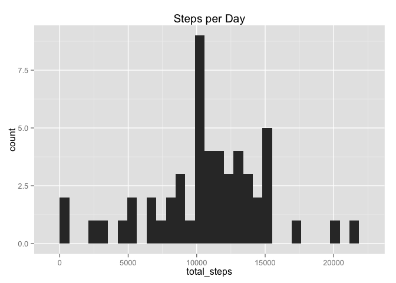
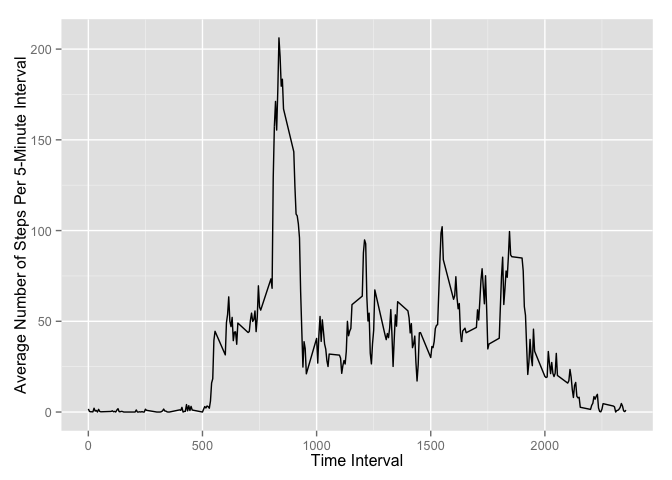
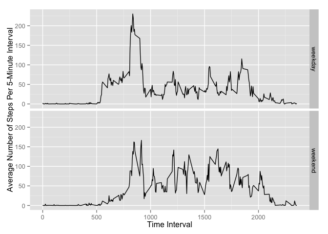

# Reproducible Research: Peer Assessment 1


## Loading and preprocessing the data


```r
df <- read.csv("activity.csv")
df$date <- as.POSIXct(df$date,format="%Y-%m-%d")
dfClean <- df[complete.cases(df),]
```

## What is mean total number of steps taken per day?

Steps per day

```r
library(sqldf)
library(xtable)
stepsPerDay <- sqldf("select date as day,sum(steps) total_steps from dfClean group by date")   
xt <- xtable(stepsPerDay)
print(xt, type="html")
```

<!-- html table generated in R 3.1.2 by xtable 1.7-4 package -->
<!-- Sun Oct 18 23:34:47 2015 -->
<table border=1>
<tr> <th>  </th> <th> day </th> <th> total_steps </th>  </tr>
  <tr> <td align="right"> 1 </td> <td align="right"> 1349128800.00 </td> <td align="right"> 126 </td> </tr>
  <tr> <td align="right"> 2 </td> <td align="right"> 1349215200.00 </td> <td align="right"> 11352 </td> </tr>
  <tr> <td align="right"> 3 </td> <td align="right"> 1349301600.00 </td> <td align="right"> 12116 </td> </tr>
  <tr> <td align="right"> 4 </td> <td align="right"> 1349388000.00 </td> <td align="right"> 13294 </td> </tr>
  <tr> <td align="right"> 5 </td> <td align="right"> 1349474400.00 </td> <td align="right"> 15420 </td> </tr>
  <tr> <td align="right"> 6 </td> <td align="right"> 1349560800.00 </td> <td align="right"> 11015 </td> </tr>
  <tr> <td align="right"> 7 </td> <td align="right"> 1349733600.00 </td> <td align="right"> 12811 </td> </tr>
  <tr> <td align="right"> 8 </td> <td align="right"> 1349820000.00 </td> <td align="right"> 9900 </td> </tr>
  <tr> <td align="right"> 9 </td> <td align="right"> 1349906400.00 </td> <td align="right"> 10304 </td> </tr>
  <tr> <td align="right"> 10 </td> <td align="right"> 1349992800.00 </td> <td align="right"> 17382 </td> </tr>
  <tr> <td align="right"> 11 </td> <td align="right"> 1350079200.00 </td> <td align="right"> 12426 </td> </tr>
  <tr> <td align="right"> 12 </td> <td align="right"> 1350165600.00 </td> <td align="right"> 15098 </td> </tr>
  <tr> <td align="right"> 13 </td> <td align="right"> 1350252000.00 </td> <td align="right"> 10139 </td> </tr>
  <tr> <td align="right"> 14 </td> <td align="right"> 1350338400.00 </td> <td align="right"> 15084 </td> </tr>
  <tr> <td align="right"> 15 </td> <td align="right"> 1350424800.00 </td> <td align="right"> 13452 </td> </tr>
  <tr> <td align="right"> 16 </td> <td align="right"> 1350511200.00 </td> <td align="right"> 10056 </td> </tr>
  <tr> <td align="right"> 17 </td> <td align="right"> 1350597600.00 </td> <td align="right"> 11829 </td> </tr>
  <tr> <td align="right"> 18 </td> <td align="right"> 1350684000.00 </td> <td align="right"> 10395 </td> </tr>
  <tr> <td align="right"> 19 </td> <td align="right"> 1350770400.00 </td> <td align="right"> 8821 </td> </tr>
  <tr> <td align="right"> 20 </td> <td align="right"> 1350856800.00 </td> <td align="right"> 13460 </td> </tr>
  <tr> <td align="right"> 21 </td> <td align="right"> 1350943200.00 </td> <td align="right"> 8918 </td> </tr>
  <tr> <td align="right"> 22 </td> <td align="right"> 1351029600.00 </td> <td align="right"> 8355 </td> </tr>
  <tr> <td align="right"> 23 </td> <td align="right"> 1351116000.00 </td> <td align="right"> 2492 </td> </tr>
  <tr> <td align="right"> 24 </td> <td align="right"> 1351202400.00 </td> <td align="right"> 6778 </td> </tr>
  <tr> <td align="right"> 25 </td> <td align="right"> 1351288800.00 </td> <td align="right"> 10119 </td> </tr>
  <tr> <td align="right"> 26 </td> <td align="right"> 1351375200.00 </td> <td align="right"> 11458 </td> </tr>
  <tr> <td align="right"> 27 </td> <td align="right"> 1351465200.00 </td> <td align="right"> 5018 </td> </tr>
  <tr> <td align="right"> 28 </td> <td align="right"> 1351551600.00 </td> <td align="right"> 9819 </td> </tr>
  <tr> <td align="right"> 29 </td> <td align="right"> 1351638000.00 </td> <td align="right"> 15414 </td> </tr>
  <tr> <td align="right"> 30 </td> <td align="right"> 1351810800.00 </td> <td align="right"> 10600 </td> </tr>
  <tr> <td align="right"> 31 </td> <td align="right"> 1351897200.00 </td> <td align="right"> 10571 </td> </tr>
  <tr> <td align="right"> 32 </td> <td align="right"> 1352070000.00 </td> <td align="right"> 10439 </td> </tr>
  <tr> <td align="right"> 33 </td> <td align="right"> 1352156400.00 </td> <td align="right"> 8334 </td> </tr>
  <tr> <td align="right"> 34 </td> <td align="right"> 1352242800.00 </td> <td align="right"> 12883 </td> </tr>
  <tr> <td align="right"> 35 </td> <td align="right"> 1352329200.00 </td> <td align="right"> 3219 </td> </tr>
  <tr> <td align="right"> 36 </td> <td align="right"> 1352588400.00 </td> <td align="right"> 12608 </td> </tr>
  <tr> <td align="right"> 37 </td> <td align="right"> 1352674800.00 </td> <td align="right"> 10765 </td> </tr>
  <tr> <td align="right"> 38 </td> <td align="right"> 1352761200.00 </td> <td align="right"> 7336 </td> </tr>
  <tr> <td align="right"> 39 </td> <td align="right"> 1352934000.00 </td> <td align="right">  41 </td> </tr>
  <tr> <td align="right"> 40 </td> <td align="right"> 1353020400.00 </td> <td align="right"> 5441 </td> </tr>
  <tr> <td align="right"> 41 </td> <td align="right"> 1353106800.00 </td> <td align="right"> 14339 </td> </tr>
  <tr> <td align="right"> 42 </td> <td align="right"> 1353193200.00 </td> <td align="right"> 15110 </td> </tr>
  <tr> <td align="right"> 43 </td> <td align="right"> 1353279600.00 </td> <td align="right"> 8841 </td> </tr>
  <tr> <td align="right"> 44 </td> <td align="right"> 1353366000.00 </td> <td align="right"> 4472 </td> </tr>
  <tr> <td align="right"> 45 </td> <td align="right"> 1353452400.00 </td> <td align="right"> 12787 </td> </tr>
  <tr> <td align="right"> 46 </td> <td align="right"> 1353538800.00 </td> <td align="right"> 20427 </td> </tr>
  <tr> <td align="right"> 47 </td> <td align="right"> 1353625200.00 </td> <td align="right"> 21194 </td> </tr>
  <tr> <td align="right"> 48 </td> <td align="right"> 1353711600.00 </td> <td align="right"> 14478 </td> </tr>
  <tr> <td align="right"> 49 </td> <td align="right"> 1353798000.00 </td> <td align="right"> 11834 </td> </tr>
  <tr> <td align="right"> 50 </td> <td align="right"> 1353884400.00 </td> <td align="right"> 11162 </td> </tr>
  <tr> <td align="right"> 51 </td> <td align="right"> 1353970800.00 </td> <td align="right"> 13646 </td> </tr>
  <tr> <td align="right"> 52 </td> <td align="right"> 1354057200.00 </td> <td align="right"> 10183 </td> </tr>
  <tr> <td align="right"> 53 </td> <td align="right"> 1354143600.00 </td> <td align="right"> 7047 </td> </tr>
   </table>

Steps per day histogram

```r
library(ggplot2)
qplot(total_steps, data = stepsPerDay, main = 'Steps per Day')
```

 

Meand and median

```r
mean(stepsPerDay$total_steps)
```

```
## [1] 10766.19
```

```r
median(stepsPerDay$total_steps)
```

```
## [1] 10765
```

## What is the average daily activity pattern?


```r
stepsPerInterval <- sqldf("select interval, avg(steps) mean_steps from dfClean group by interval")   

ggplot(data = stepsPerInterval, aes(interval, mean_steps )) + geom_line() + ylab("Average Number of Steps Per 5-Minute Interval") + xlab("Time Interval")
```

 

5-minute interval with the maximum average number of steps.

```r
idx <- which.max( stepsPerInterval$mean_steps )
stepsPerInterval$interval[[idx]]
```

```
## [1] 835
```


## Imputing missing values
Missing values

```r
dfNAs <- df[!complete.cases(df),]
nrow(dfNAs)
```

```
## [1] 2304
```

Replacing missing values by the mean for that 5-minute intervals.


```r
for (i in 1:length(df[, 1])){
    if (is.na(df[i,1])){
        date <- df[i,2]
        interval <- df[i,3]
        mean_steps <- subset(stepsPerInterval, interval == df[i,3])$mean_steps
        df[i,1] <- mean_steps
    }

}
```


Steps per day histogram

```r
stepsPerDay <- sqldf("select date as day,sum(steps) total_steps from df group by date") 
library(ggplot2)
qplot(total_steps, data = stepsPerDay, main = 'Steps per Day')
```

 

Meand and median

```r
mean(stepsPerDay$total_steps)
```

```
## [1] 10766.19
```

```r
median(stepsPerDay$total_steps)
```

```
## [1] 10766.19
```

Do these values differ from the estimates from the first part of the assignment? 

What is the impact of imputing missing data on the estimates of the total daily number of steps?

## Are there differences in activity patterns between weekdays and weekends?


```r
weekenddays <- c("Saturday","Sunday")
areWeekends <- weekdays(df$date) %in% weekenddays

df$dayOfTheWeek <- rep(NA, nrow(df))
df[areWeekends,]$dayOfTheWeek <- "weekend"
df[!areWeekends,]$dayOfTheWeek <- "weekday"
df$dayOfTheWeek <- as.factor(df$dayOfTheWeek)


stepsPerIntervalPerDay <- sqldf("select interval, avg(steps) mean_steps, dayOfTheWeek from df group by interval,dayOfTheWeek")  

sp <- ggplot(data = stepsPerIntervalPerDay, aes(interval, mean_steps)) + geom_line() + ylab("Average Number of Steps Per 5-Minute Interval") + xlab("Time Interval")

sp + facet_grid(dayOfTheWeek ~ .)
```

 

